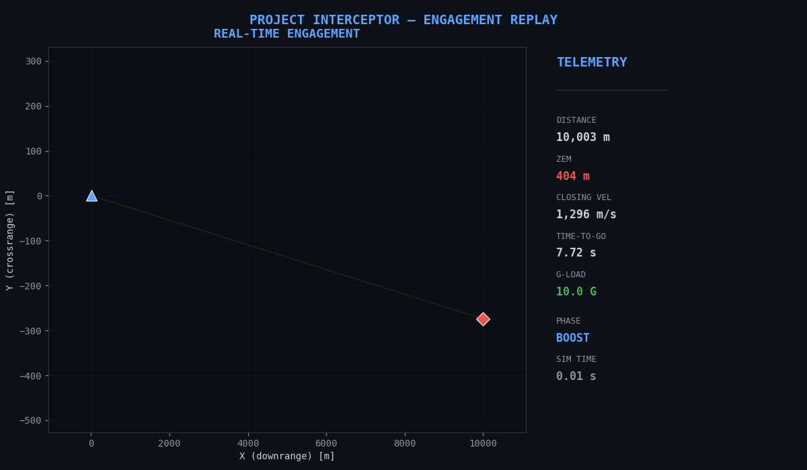
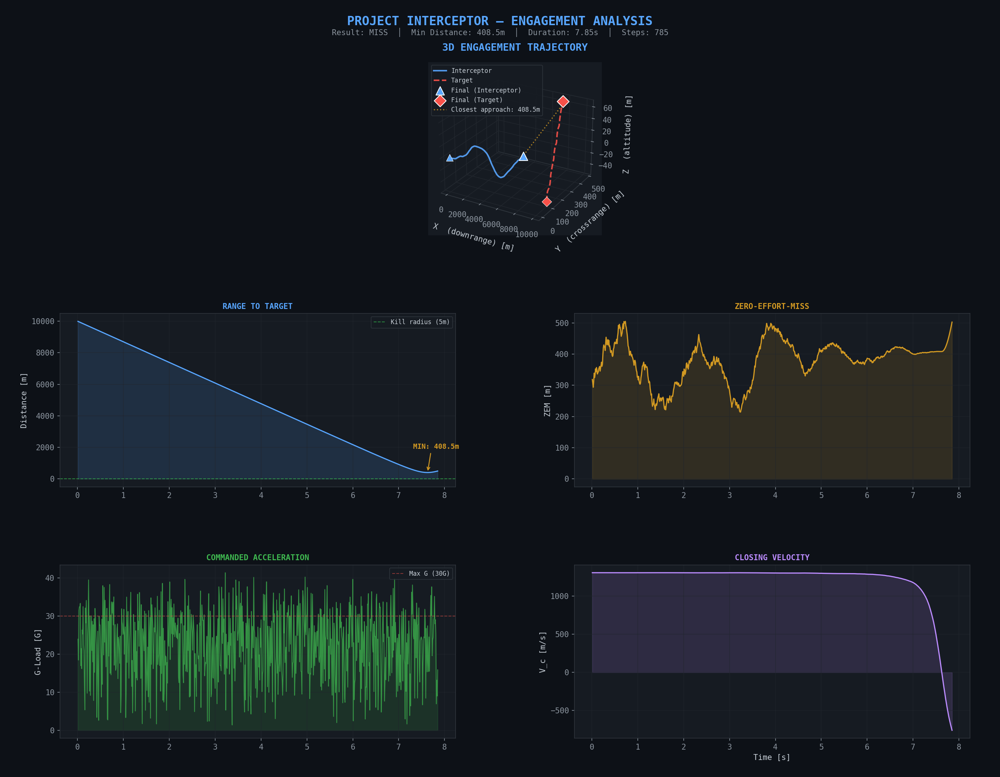
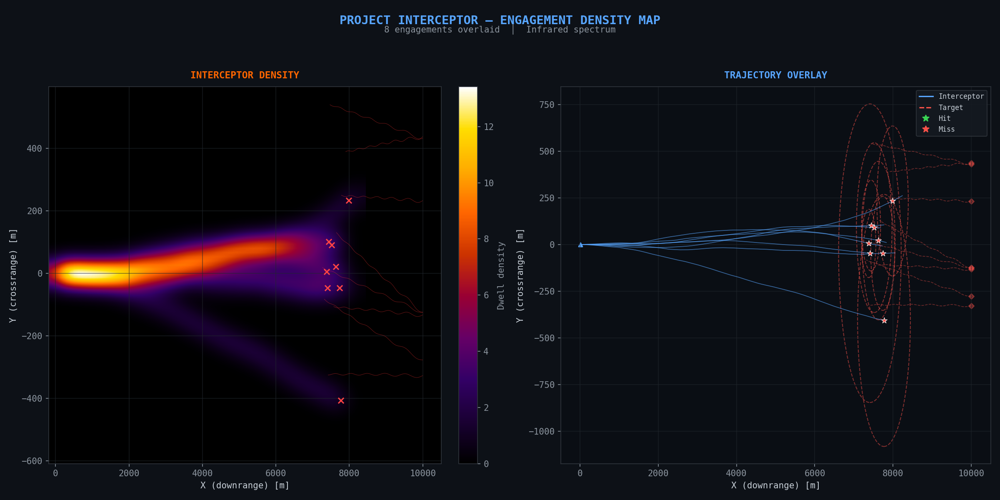
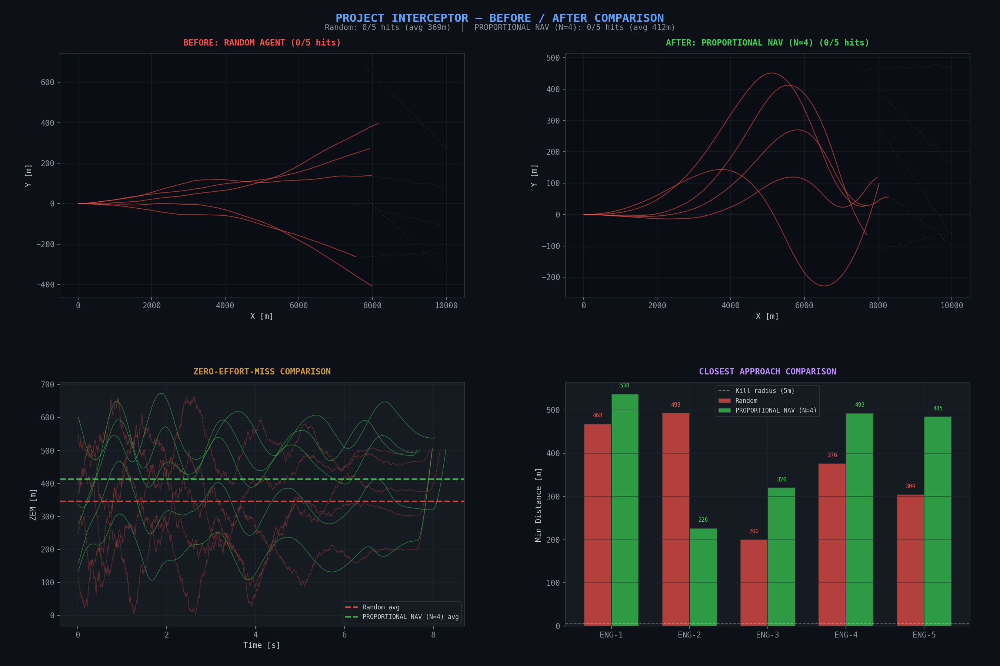
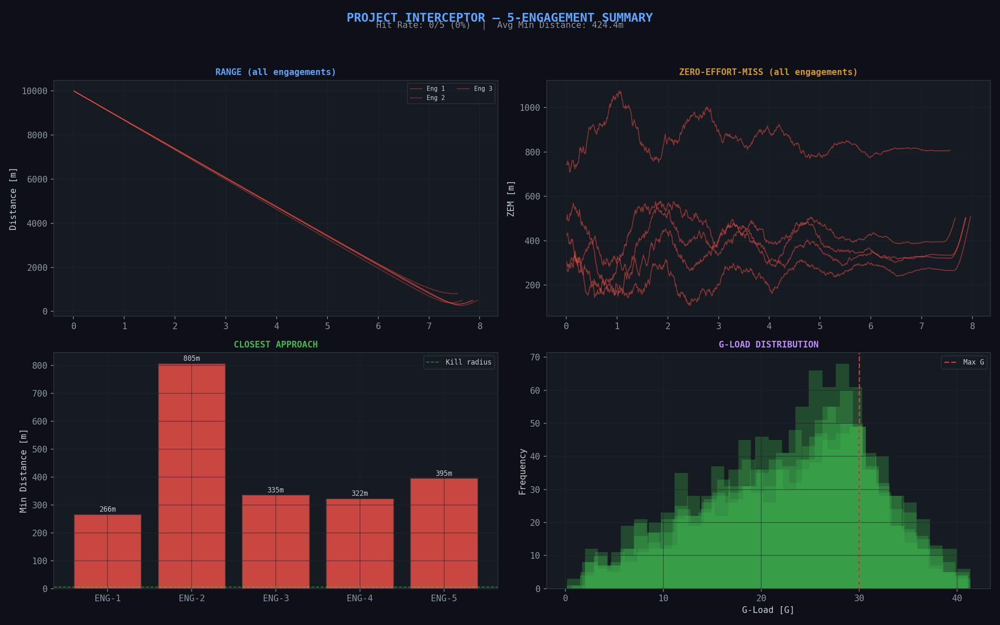
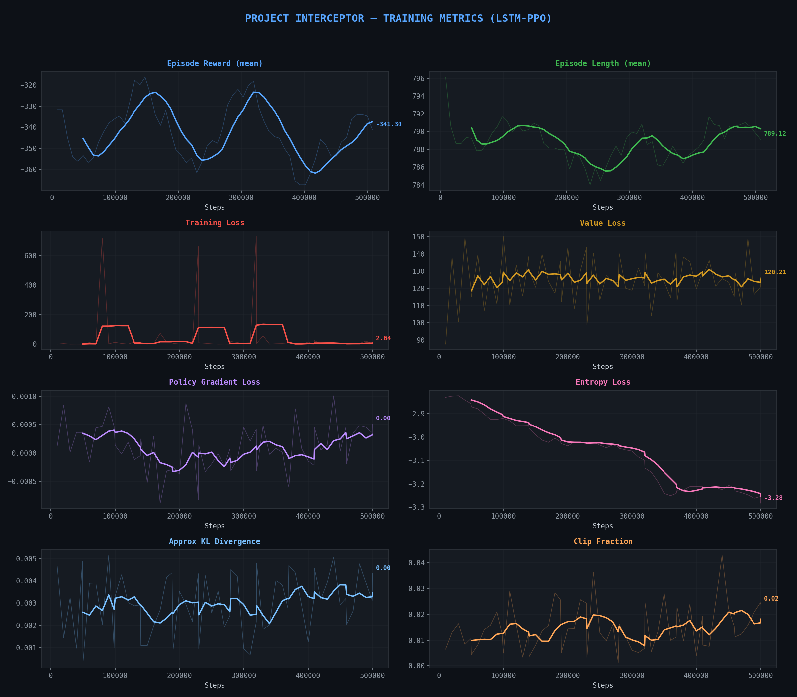

<p align="center">
  
</p>

<h1 align="center">🎯 INTERCEPTOR</h1>
<h3 align="center">Autonomous Swarm Defense Architecture</h3>

<p align="center">
  <em>A production-grade, distributed AI system for autonomous missile interception.<br>
  Integrates Reinforcement Learning, real-time streaming, causal AI, and agentic control.</em>
</p>

<p align="center">
  
  
  
  
  
  
</p>

---

## 🏗️ Architecture

INTERCEPTOR is a **5-layer microservice architecture** where each layer runs independently and communicates through well-defined interfaces:

```
┌────────────────────────────────────────────────────────────────┐
│                    AGENTIC COMMAND LAYER                       │
│              LangGraph Supervisor (graph FSM)                  │
│         Threat Assessment → Assignment → Monitoring            │
├────────────────────────────────────────────────────────────────┤
│                    CAUSAL AI LAYER                             │
│           Physics-based decoy rejection filter                 │
│        Acceleration / velocity / trajectory checks             │
├────────────────────────────────────────────────────────────────┤
│               INTELLIGENCE LAYER (RL)                          │
│         LSTM-PPO Agent  •  Transformer Extractor               │
│     Stable-Baselines3 + sb3-contrib • TensorBoard              │
├────────────────────────────────────────────────────────────────┤
│                 DATA STREAMING LAYER                           │
│          Kafka Producer/Consumer pipeline                      │
│         Real-time telemetry with sliding window                │
├────────────────────────────────────────────────────────────────┤
│                PHYSICS SIMULATION LAYER                        │
│           3-DOF Missile Guidance Environment                   │
│       Proportional Navigation • ZEM • LOS Rate                 │
└────────────────────────────────────────────────────────────────┘
```

## 📊 Visualizations

### 3D Engagement Trajectory
<p align="center">
  
</p>

### Infrared Engagement Heatmap
<p align="center">
  
</p>

### Before / After Training Comparison
<p align="center">
  
</p>

### Multi-Engagement Summary
<p align="center">
  
</p>

---

## 🚀 Quick Start

```bash
# Clone
git clone https://github.com/Nikhilchapkanade/INTERCEPTOR.git
cd interceptor

# Setup
python -m venv venv
venv\Scripts\activate        # Windows
# source venv/bin/activate   # Linux/Mac

pip install -r requirements.txt
```

## 🎮 CLI Modes

```bash
# Run the physics simulation (random agent)
python main_orchestrator.py --mode sim --episodes 5

# Rich terminal demo with live radar display
python main_orchestrator.py --mode demo --episodes 3

# Generate all matplotlib visualizations
python main_orchestrator.py --mode plot --episodes 5

# Train the LSTM-PPO agent
python main_orchestrator.py --mode train --timesteps 500000

# Test Kafka streaming pipeline
python main_orchestrator.py --mode stream

# Test causal AI decoy filter
python main_orchestrator.py --mode filter

# Test LangGraph supervisor
python main_orchestrator.py --mode graph

# Full integration (all layers)
python main_orchestrator.py --mode full --kafka
```

---

## 🧠 Technical Deep Dive

### Physics Layer (`simulation/`)
| Module | Description |
|--------|-------------|
| `kinematics.py` | ZEM computation, LOS rate, proportional navigation, Euler-to-DCM |
| `guidance_env.py` | Custom Gymnasium env — 3-DOF missile guidance with shaped rewards |
| `visualizer.py` | Rich terminal display with ASCII radar, live telemetry, threat bars |
| `plotter.py` | Matplotlib trajectory plots, telemetry dashboards |
| `advanced_viz.py` | Animated GIF, infrared heatmap, before/after comparison |

### Intelligence Layer (`intelligence/`)
| Module | Description |
|--------|-------------|
| `policy_network.py` | LSTM and Transformer feature extractors for SB3 |
| `train_agent.py` | LSTM-PPO training with checkpointing and TensorBoard |
| `causal_filter.py` | Physics-based decoy rejection (acceleration, velocity limits) |

### Data Layer (`streaming/`)
| Module | Description |
|--------|-------------|
| `producer.py` | Kafka telemetry producer with in-memory fallback |
| `consumer.py` | Kafka consumer with sliding-window state management |

### Command Layer (`supervisor/`)
| Module | Description |
|--------|-------------|
| `graph_state.py` | Pydantic state models for LangGraph |
| `vlm_commander.py` | LangGraph state machine — assess → assign → engage → handle |

---

## 📈 Training

```bash
# Short training run
python main_orchestrator.py --mode train --timesteps 8192

# Production training (recommended)
python main_orchestrator.py --mode train --timesteps 1000000

# Monitor with TensorBoard
tensorboard --logdir guidance_tensorboard/
```

The agent uses **LSTM-PPO** with temporal reasoning to learn pursuit guidance. Key training metrics:
- **Episode Reward** — converges as the agent learns to close distance
- **ZEM (Zero-Effort-Miss)** — decreases as guidance improves
- **Hit Rate** — the ultimate metric

### Training Dashboard
<p align="center">
  
</p>

---

## 🛠️ Tech Stack

| Component | Technology |
|-----------|------------|
| Simulation | Gymnasium, NumPy, SciPy |
| RL Engine | Stable-Baselines3, sb3-contrib, PyTorch |
| Streaming | kafka-python (with in-memory fallback) |
| Agentic Control | LangGraph, LangChain |
| Visualization | Matplotlib, Rich |
| Monitoring | TensorBoard |

---

## 📁 Project Structure

```
interceptor/
├── main_orchestrator.py        # CLI entry point (8 modes)
├── requirements.txt
├── simulation/
│   ├── kinematics.py           # Physics engine
│   ├── guidance_env.py         # Gymnasium environment
│   ├── visualizer.py           # Rich terminal display
│   ├── plotter.py              # Matplotlib plots
│   └── advanced_viz.py         # GIF, heatmap, comparison
├── intelligence/
│   ├── policy_network.py       # LSTM/Transformer extractors
│   ├── train_agent.py          # Training pipeline
│   └── causal_filter.py        # Decoy rejection
├── streaming/
│   ├── producer.py             # Kafka producer
│   └── consumer.py             # Kafka consumer
├── supervisor/
│   ├── graph_state.py          # LangGraph state
│   └── vlm_commander.py        # Mission supervisor
└── output/                     # Generated visualizations
    ├── engagement_plot.png
    ├── engagement_animation.gif
    ├── engagement_heatmap.png
    ├── before_after_comparison.png
    └── multi_engagement.png
```

---

## 📄 License

MIT License
